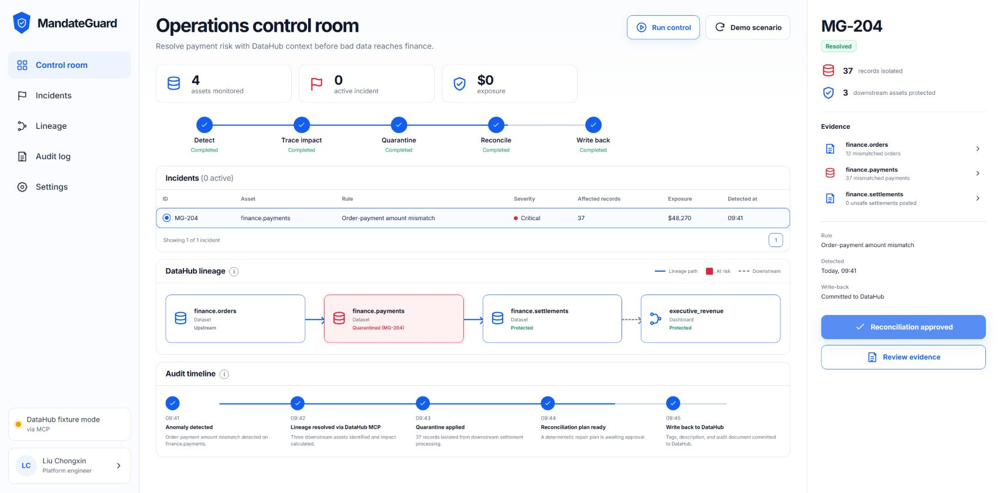

# MandateGuard

MandateGuard is an AI-native operations data control center built for the
**Build with DataHub: The Agent Hackathon**. It detects order/payment
mismatches, calculates downstream impact with DataHub lineage, quarantines
unsafe records, prepares a reconciliation plan, and writes governed results
back to DataHub.



## Public demo

Try the interactive hackathon demo at
[agentic-build-lab.github.io/mandateguard-datahub](https://agentic-build-lab.github.io/mandateguard-datahub/).
The public build runs the deterministic MG-204 fixture in the browser. The
repository also includes the server-side DataHub MCP gateway used for connected
deployments.

## Why DataHub

Without metadata context, an operations agent can identify bad rows but cannot
reliably answer what will break next, who owns it, or where to leave reusable
knowledge. MandateGuard uses DataHub MCP for:

- asset discovery and entity context;
- upstream/downstream lineage and impact analysis;
- quarantine and finance-critical tags;
- appended incident context; and
- a durable audit document for future people and agents.

## Run locally

Requirements: Node.js 20+.

```bash
npm install
npm run build
npm start
```

Open `http://127.0.0.1:8787`.

For development:

```bash
npm run dev
```

The React app runs at `http://127.0.0.1:4173` and proxies API calls to port
`8787`.

## Connect DataHub MCP

Copy `.env.example` values into your process environment:

```text
DATAHUB_MCP_URL=https://<tenant>.acryl.io/integrations/ai/mcp/
DATAHUB_TOKEN=<personal-access-token>
DATAHUB_MUTATIONS_ENABLED=true
```

For self-hosted DataHub, run the official `mcp-server-datahub` as a separate
service and configure that service with `DATAHUB_GMS_URL` and
`DATAHUB_GMS_TOKEN`. Set `DATAHUB_MCP_URL` to the MCP service's Streamable HTTP
endpoint, not directly to GMS. Keep application mutations disabled while
validating connectivity.

In connected mode, **Run control** first checks the MCP tool catalog, discovers
`finance.payments` with `search`, fetches its metadata with `get_entities`, and
reads both upstream and downstream `get_lineage` results. The API builds the
displayed asset graph from those responses and fails clearly if the required
asset, entity context, or tools are unavailable.

`DATAHUB_MUTATIONS_ENABLED=true` is MandateGuard's deployment-level write gate.
The DataHub MCP server must separately expose its mutation tools (typically
with `TOOLS_IS_MUTATION_ENABLED=true`), and the two tag URNs used by the
scenario must already exist in the catalog.

## Demo workflow

1. Select **Run control** to load the deterministic MG-204 scenario.
2. Inspect the order-payment mismatch and DataHub lineage blast radius.
3. Select **Approve reconciliation**.
4. Verify exposure reaches zero and the final audit step completes.

The fixture gateway records three simulation receipts matching the planned
remote operations: `add_tags`, `update_description`, and `save_document`. It
does not change a DataHub tenant.

## Quality checks

```bash
npm run check
```

Sample output is available in
[`examples/sample_outputs/mg_204_audit.json`](examples/sample_outputs/mg_204_audit.json).
The submission video's media provenance is recorded in
[`docs/demo_video_media_sources.md`](docs/demo_video_media_sources.md).

## Pre-existing work disclosure

The entrant previously created an Operations Data Control Center prototype
that informed the problem selection and domain requirements. MandateGuard's
code, DataHub MCP integration, interface, sample scenario, documentation, and
submission assets were created from scratch during the hackathon submission
period. No source code from the earlier prototype is included.

## License

Apache License 2.0.
